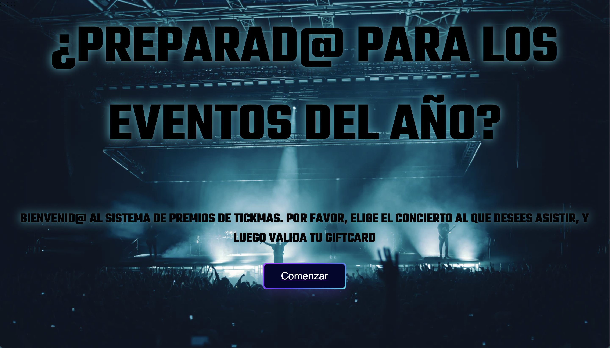
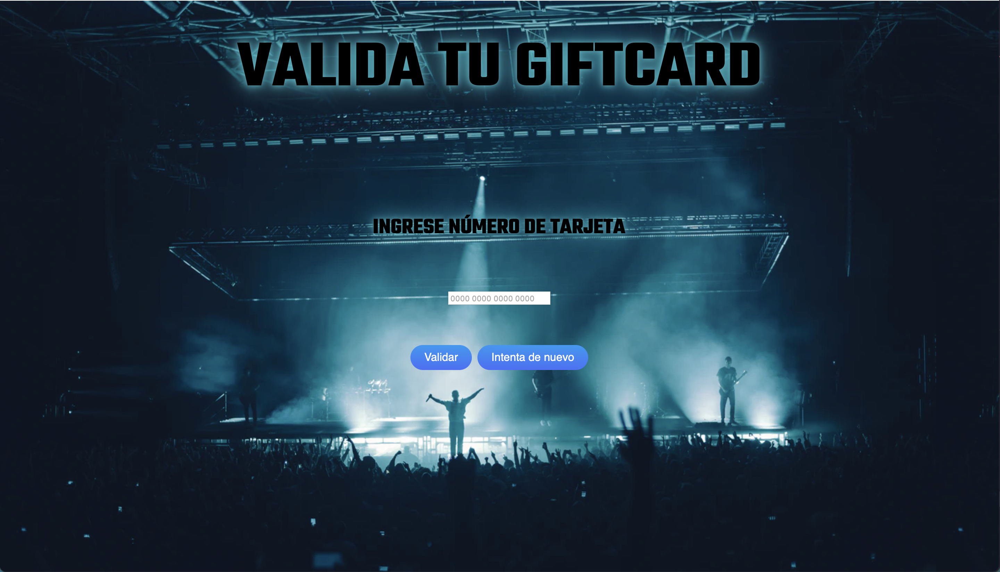
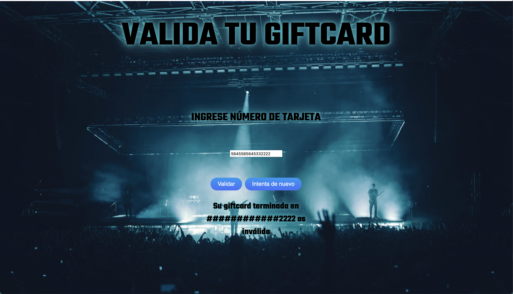

# TickMas sistema de regalos a usuarios

## Índice

- [1. Resumen](#1-Resumen)
- [2. Investigación UX](#2-Investigación-UX)

---

## 1. Resumen

TickMas es una empresa de venta de boletos para conciertos, el cual ofrece además beneficios a sus clientes. En la página web permite validar una Giftcard regalada a cierto número de usuarios, los cuales tendrán opción de elegir entre dos tipos de conciertos.

Página principal con el botón de "Comenzar"

Segunda página donde los usuarios deben elegir al concierto que deseen asistir

Tercera página, donde deben ingresar el número de Giftcard asignado para validar

Tras la validación, la página indicará, mediante el algoritmo de Luhn si la Giftcard es válida o inválida, utilizando el enmascarado en el mensaje. Además lanzará una alerta si el usuario intenta ingresar letras (sólo son válidos números).

## 2. Investigación UX

Considerando que los conciertos son algo muy popular, la empresa de fantasía en cuestión tiene un sistema de regalos para sus usuarios, con la finalidad de fidelizar clientes.

### Prototipo inicial

### Feedback

### Prototipo final
